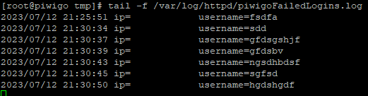
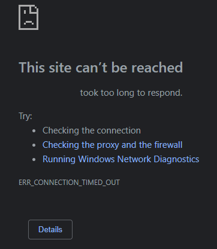

# Piwigo-RHEL8-Apache-PHP7.2

## Getting Started

Had someone ask me to create a photo gallery, so they could keep track of paints and glazes information as an artist.  Eventually I built something, but I thought there had to be something out there already. Stumbled across Piwigo, so just made a small "how to" for it, of course, more for me then anyone else.
 
 
I could always use the help. So, please…without hesitation, give me feedback.  More important, give me the best practice. I have no qualms with people showing and telling me how to better my limited knowledge.
 
 
Quote by Ram Dass: (or << Backtrack)  
“The quieter you become, the more you can hear.”

## Dependencies

<b>Using Red Hat DISA-STIG security profile</b>

Keep in mind of Internal and External DNS and rules on your routers\firewalls, assuming you want this to be public.
Also note that the versions may be different, based on when you install
<ul>
    <li>Piwigo 13.8.0</li>
    <li>Red Hat Enterprise Linux 8.8 (Ootpa)</li>
    <li>10.3.35-MariaDB MariaDB Server</li>
    <li>Apache/2.4.37 (Red Hat Enterprise Linux)</li>
    <li>PHP 7.2.24</li>
    <li>certbot 1.22.0</li>
    <li>Python3</li>
    <li>Fail2Ban v1.0.2</li>
</ul>

## Installing\Executing 

What I like to do for this is log in as root or sudo su -.  then copy the script into the /tmp/ and then kick it off.
The first part of the script is for variables. 
You will need to make those changes yourself   
A few things to consider first:

### SERVER STUFF
This is basically going to be your external DNS name for your website.
Its what you will enter into the URL
 
<b>SERVERNAME=Piwigo.Your.Domain</b>

### FAIL2BAN STUFF
This is a tool to block IPs when bad actors try to access your site to many times incorrectly.
Piwigo does not capture this information natively, so you will need to manually install a plugin "Failed Login".  
Within the script we prepare for this by creating the file and setting permissions.
In order for Fail2Ban to know what to do, you create a Jail and Filter (Definitions), in the script these are set by you. 
 

Ban duration in seconds (1 hour)
 
<b>BANDURATION=3600</b>

Time window in seconds to search for failed login attempts (10 minutes)
 
<b>FAILEDSEARCH=600</b>

Time window in seconds to search for failed login attempts (10 minutes)
 
<b>MAXATTEMPTS=5</b>

To find out what IP has been banned because of failed access to Piwigo
 
<b>fail2ban-client status piwigo</b>

After you find the IP, now remove the IP 
 
<b>fail2ban-client set piwigo unbanip <IP_address></b>

### CERT STUFF
We are creating self signed certs within the script using FIPS.

I have 2 ways of doing Certs using CertBot (HTML-01 and DNS-01).  In order for either way this to work YOU will need to set up DNS information at your DNS provider. 
<ul>
    <li>HTTP-01 challenge: This challenge asks you to prove that you control the HTTP service for the domain in question. You do this by placing a specific file with a specific name and content in the .well-known/acme-challenge/ directory of your website.</li>
    <li>DNS-01 challenge: This challenge asks you to prove that you control the DNS for your domain. You do this by placing a specific DNS TXT record in your domain's DNS settings.</li>
</ul>
In general, most people use the HTTP-01 challenge because it's straightforward and can be easily automated with the Certbot tool, provided that port 80 is open to the internet. The DNS-01 challenge is the only method that can be used to issue wildcard certificates (*.yourdomain.com).
 
 
This is the name that you will enter in the URL
 
<b>SERVERNAME=piwigo.Your.Domain</b>
 
 
Email for the Cert
 
<b>CERTMAIL=your @ email.com</b>
 

### DB STUFF

This is the name of the database that will create for nextcloud
 
<b>DBNAME=piwigodb</b>

This is the username that is needed for the MediaWiki database.
 
<b>USER=piwigouser</b>

### PASSWORD STUFF
In the script, it prduces a random password, you can always use your own password by adding it to the variables.

This generates a random password for the root account of mariadb. You can change it if you wish
 
<b>date +%s | sha256sum | base64 | head -c 16 > /tmp/.MARIADBPASSWORD</b>

This generates a random password for the MediaWiki user account in mariadb. You can change it if you wish
 
<b>date +%s | sha256sum | base64 | head -c 16 >> /tmp/.APPPASSWORD</b>

### CLEANING UP
When the script is done running it will remind you that there are passwords and scripts in the /tmp. Keep them there as long as you need them, but do remember to clean house.  If a bad actor popped into you machine, they would have the key to your kingdom.

  

## Final Installation
When the script is done running, you will see in the terminal the information to finish the installation. 
When you goto <b>https://ip</b> you should see something like this: 

  

 
Fill out the info using the terminal to answer the Database info.  The admin config is all you, you choose.
When done, click "Start Installation"
 
You should now see a congratulations page.  Just click "Visit the galllery" 

  

 
Now you should be at a screen welcoming you and asking how to proceed.  Just click at the bottom 
<b>... or please deactivate this message, I will find my own way</b>

  

 
You should now be at the main page of the application.  We are going to setup the Failed login Plugin, so that we can allow fail2ban to do it's thing.  Go to the top right and click on "ADMIN"

  

 
Now on the left you are going to click on "PLUGINS"

  

 
In the main window you should see a list of plugins.  Click on the "ADD A NEW PLUGIN" tab

  

 
In the search bar type in "fail".  Find the "FAILED LOGINS" plugin and cick the "ADD" button

  

 
A warning window will pop asking if you are sure you want to add the plugin, click "YES,I AM SURE"

  

 
Wait sec and you should see the page refresh and a banner will appear telling you that the plugin has been copied.

  

 
Now click on the "LIST" tab and search for the "PIWIGO FAILED LOGIN LOGGER".  Click the little swith to activate the plugin and then click "SETTINGS"

  

 
You will be brought to a new page asking for the Log filename (including absolute path).Use the path that we setup during the installation:
/var/log/httpd/piwigoFailedLogins.log
and Hit "SUBMIT"
Then a banner will appear saying "Configuration update"

  
  

 
If you want to see if it is woking, log out of Piwigo.   
Go to the terminal and <b>"tail -f /var/log/httpd/piwigoFailedLogins.log"</b>
Then attempt to login with wrong credentials

  
  
  

 
About the 5th or 6th time hit the refresh button on your browser and watch as you cannot get to the site anymore 

  

 